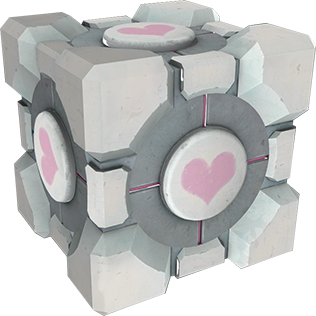

# Aperture Container Enrichment Center

A hands-on demo of **SUSE Security (NeuVector) 5.x** — runtime container security
on a single-node Kubernetes cluster. Built and tested on **Rancher Desktop**;
written to run on any single-node cluster (k3s/k3d, kind, minikube) behind a
`$PLATFORM` switch.



> GLaDOS has prepared some test chambers. The clean app is the *weighted
> companion pod*; the attacker who `kubectl exec`s into it is the *combustible
> lemon*; flipping NeuVector to Protect mode is *glados-enforcer-mode*; the
> Enforcer politely dropping the malicious connections is the *dpi-sentry-turret*.
> Those are narrative aliases — the real Kubernetes objects have boring names
> (`chell-test`, `wheatley`, `aperture-sci`, `aperture-labs`).

---

## What it demonstrates

One thesis: **runtime security is behavioral, not signature-based — and
enforcement belongs inside the pod, at the process level, not at a network
perimeter.** Seven supporting claims (A–G in [`docs/PLAN.md`](docs/PLAN.md) §1),
each carried by a numbered **test chamber**:

| Chamber | Scenario | Point |
|---------|----------|-------|
| **00** | Deploy two apps, watch NeuVector learn in Discover mode | A behavioral baseline is built with zero changes to the app |
| **01** | Flip the clean app to Protect | Learned traffic is unaffected — zero-trust ≠ zero-connectivity |
| **02** | `exec` in and attack: spawn a shell, `curl` an unknown host, `wget` a *known* host | Enforcement is on the **process** making the connection, not the destination IP |
| **03** | Add a live `*.fastly.com` deny rule to a running workload | Policy is decoupled from the workload — no restart, no redeploy, no manifest edit |
| **04** | WAF: SQL-injection + path-traversal payloads inside an allowed connection | Layer 7 payload inspection, per workload, with no separate appliance |
| **05** | The same attacks against a **distroless** image (`wheatley`) | Image hardening and runtime enforcement are complementary, not substitutes |
| **06** | Walk the Security Events timeline | Full audit trail — the IL4/IL5 compliance angle |

The authoritative plan (thesis, chambers, decisions) is
[`docs/PLAN.md`](docs/PLAN.md). Term definitions are in
[`docs/00-glossary.md`](docs/00-glossary.md).

---

## Prerequisites

- A **single-node Kubernetes cluster** — Rancher Desktop (reference), or
  k3s/k3d, kind, minikube. Give it **~6–8 GB RAM** and **4 vCPU**.
- `kubectl`, `helm` v3, `envsubst` (GNU gettext), and a container tool
  (`nerdctl` or `docker`).

Full setup and per-platform notes: [`docs/10-setup.md`](docs/10-setup.md) and
[`docs/platform-notes/`](docs/platform-notes/).

---

## Quickstart

```bash
cp Files/env.sh.example env.sh     # then edit: PLATFORM, KUBE_CONTEXT, NEUVECTOR_CHART_VERSION
Scripts/00_preflight.sh            # verify cluster reachable + tools present
Scripts/10_install_neuvector.sh   # helm upgrade --install NeuVector
Scripts/20_expose_console.sh      # port-forward https://localhost:8443  (admin / admin)
Scripts/30_deploy_apps.sh         # chell-test  -> aperture-sci   (fat image: nicolaka/netshoot)
Scripts/31_deploy_distroless.sh   # wheatley    -> aperture-labs  (builds + loads the image)
```

`20_expose_console.sh` runs in the foreground — background it (`&`) or use a
second terminal. Let the NeuVector groups sit in **Discover** for a few minutes
to build a baseline, then run a walkthrough:

- [`docs/Security_Demo.md`](docs/Security_Demo.md) — Chambers 00–04 + 06, fat image
- [`docs/Security_Demo_Distroless.md`](docs/Security_Demo_Distroless.md) — Chamber 05, distroless
- [`docs/Security_Discussion.md`](docs/Security_Discussion.md) — threat-model background

Every script is idempotent and reads its config from `env.sh` via
`Scripts/lib/common.sh` — nothing is hard-coded.

---

## Repo layout

| Path | Contents |
|------|----------|
| `docs/` | `PLAN.md`, glossary, setup, the three walkthroughs, `platform-notes/` |
| `Scripts/` | Ordered `NN_verb_noun.sh` steps + `lib/common.sh` (the portability spine) |
| `manifests/` | Kubernetes YAML, grouped by namespace; `${VAR}` placeholders rendered from `env.sh` |
| `apps/wheatley/` | `main.go` + multi-stage Dockerfile for the distroless demo app |
| `Files/env.sh.example` | Config template — copy to `./env.sh` (git-ignored) |
| `CLAUDE.md` | Conventions for humans and AI agents working in this repo |
| `.claude/skills/add-chamber/` | Skill: scaffold a new test chamber |

---

## Status

Scaffold and walkthroughs are complete. `Scripts/00`–`31` are built and
`shellcheck -x` clean; the `wheatley` image builds and serves. **Not yet done:**
`Scripts/40_attack_fat.sh` (scripted Chamber 02 sequence) and
`Scripts/90_reset_demo.sh` (teardown), plus a full live dry-run to pin down the
exact NeuVector 5.4.x console wording. Progress is tracked in
[`docs/PLAN.md`](docs/PLAN.md) §8–9.

<sub>Repo also answered to: <em>neu-sheriff-in-town</em>, <em>whats-your-vector-victor</em>.</sub>
